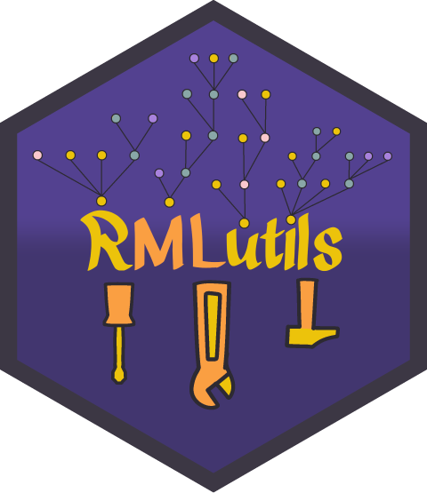

# RMLutils

[](README.md)
[](README.es.md)

Library of utilities for machine learning in official statistics, offering a common interface for multiple ML libraries.

The tutorials folder contains usage examples. Reviewing RMLUtils_info.Rmd is recommended before checking the remaining tutorials.

RMLUtils has a sibling library implemented in Python with similar functionalities, named [pymlutils](https://github.com/es-ine/pymlutils).

# Work in Progress
This project is currently under active development. 

## Disclaimer

This repository and its contents are provided for informational and technical purposes only.  
Use of this code is at your own risk.

The Instituto Nacional de Estadística (Spanish Statistical Office) provides this software **"as is"**, without warranty of any kind, either expressed or implied.

By using this repository, you acknowledge that:
- You are responsible for reviewing and testing the code before using it in any production or critical environment.
- The Instituto Nacional de Estadística is **not liable** for any direct, indirect, or consequential damages arising from the use of this software.


## Table of contents
- [Features](#features)
- [Github installation](#github-installation)
- [Manual installation](#manual-installation)
    - [Local compiling and installation](#local-compiling-and-installation)
- [Authors](#authors)

## Features

1) Sampler objects:
    * srsSampler
    * ssSampler
    * bootstrapSampler
    * cvSampler
    * cvGroupSampler
    * cvMixedSampler
    * cvTemporalSampler
    * fullSampler
2) Modeler objects for classification:
    * H2OClassifierModeler
    * LGBClassifierModeler
    * rangerClassifierModeler
    * catboostClassifierModeler
    * miceClassifierModeler
    * preproClassifierModeler
3) Modeler objects for regression:
    * directRegressorModeler
    * HTRegressorModeler
    * strataHTRegressorModeler
    * strataMeanRegressorModeler
    * H2ORegressorModeler
    * LGBRegressorModeler
    * rangerRegressorModeler
    * catboostRegressorModeler
    * miceRegressorModeler
    * classifRegRegressorModeler
    * benchRegressorModeler
    * preproRegressorModeler
    * prePredRegressorModeler
    * memoryRegressorModeler
4) Cost functions for classification:
    * confusionMatrixCostFunction
    * accuracyCostFunction
    * precisionCostFunction
    * recallCostFunction
    * f1ScoreCostFunction
    * ROCAUCCostFunction
5) Cost functions for regression:
    * r2CostFunction
    * squareBiasCostFunction
    * MSECostFunction
    * groupMSECostFunction
    * groupTotalErrorCostFunction
    * MCSubRBMSECostFunction
    * holdoutTemporalCostFunction
6) Implemented pre-processing functions and objects:
    * preproObject
    * minMaxScalerPreproFunction
7) Score-to-class mapping:
    * maxScoreClass
    * binaryThresholdClass
8) Estimator functions:
    * HTEstimate
    * HTDomainEstimate
    * REstimate
    * RDomainEstimate
    * MCSubRBEstimate
    * MCSubRBDomainEstimate
    * preTrainedEstimate
    * preTrainedDomainEstimate


Every modeler has multiple useful methods:
- train
- get_predictions
- get_classes (only for classifier modelers)
- cross_validate
- evaluate
- model_save
- model_load

Note that H2O modelers and PreproModelers require some additional input from the user. Checking the example markdowns in the tutorials folder is recommended.

Currently, this project contains ML models from the following libraries:

- [](https://catboost.ai/)
- [](https://lightgbm.readthedocs.io/en/latest/R/index.html)
- [](https://docs.h2o.ai/h2o/latest-stable/h2o-r/docs/reference/h2o-package.html) 
- [](https://github.com/imbs-hl/ranger)
- [](https://github.com/amices/mice)

## Requirements

**R 4.4.2 or higher**

To keep the instalation as light as possible, RMLutils only imports [data.table](https://github.com/rdatatable/data.table) and [zip](https://github.com/cran/zip). The user is then free to install the required packages for the modeler objects that they wish to use.
The following packages are available at CRAN (so the user will simply have to run a ``` install.packages('<package-name>')``` command):

- lightgbm   >=4.6.0     (used by LGBModelers)
- h2o        >=3.44.0.3  (used by H2OModelers)
- ranger     >=0.17.0    (used by rangerModelers)
- mice       >=3.18.0    (used by miceModelers)
- osqp       >=1.0.0     (used by benchModeler)
- gsubfn     >=0.7       (used by benchModeler)
- Matrix     >=1.7-1     (used by benchModeler)

Some RMLutils modelers also make use of catboost, which can be installed following the instructions found at this [link](https://catboost.ai/docs/en/concepts/r-installation). If the user has trouble installing the package, it is heavily recommended to download the tar.gz file, unzip it, and manually install it such as:

```
install.packages("/path/to/unzipped/file", 
repos = NULL, 
type = "source",
INSTALL_opts = c("--no-multiarch"))
```

Some recent versions may not work, so if the user is unable to install their selected version, we recommend downloading an older version. Check that the DESCRIPTION file is inside the unzipped folder. All our testing was done using the 1.2.8 version (for windows).

## Project structure

Users can use RMLutils by installing it manually or via GitLab/GitHub.

If you want to learn or consult how to use RMLutils, you can examine the example markdowns in the tutorials folder, which detail the main features of RMLutils.

It is recommended that users learn how to use the sampler and modeler objects first, before familiarizing themselves with the other elements of the library.

```text
root/
├── README.md
├── README.es.md
├── DESCRIPTION
├── NAMESPACE
├── man/
│   ├── accuracyCostFunction.Rd
│   ├── addMemory.Rd
│   └── ...
├── tutorials/
│   ├── es/
│   │   ├── sampler_tutorial.rmd
│   │   ├── modeler_tutorial.rmd
│   │   ├── cost_function_tutorial.rmd
│   │   ├── h2o_modeler_tutorial.rmd
│   │   ├── classif_reg_modeler_tutorial.rmd
│   │   ├── prepro_modeler_tutorial.rmd
│   │   └── ...
│   └── en/
│       └── ...
├── tests/
│   └── testthat
│       ├── test-classifierModeler.R
│       ├── test-classMapping.R
│       ├── test-costFunctions.R
│       ├── test-estimator.R
│       ├── test-regressorModeler.R
│       └── test-sampler.R
│
└── R/
    ├── classifierModeler.R
    ├── classMapping.R
    └── ...
```

## Github installation

If the user wants to install the package from GitHub, they must first install the remotes package:

```bash
install.packages("remotes")
```

Then, run the following command:

```bash
remotes::install_github("es-ine/rmlutils")
```

## Manual installation

Assuming the user clones the repository and that the R project is active, it is possible to install the library using the devtools library, running the following command:

```bash
devtools::build()
```

Or, if the user has RStudio installed, the library can be built by clicking the Install button located at the Build tab when running the editor.

### Local compiling and installation

Whenever changes are made to the source scripts, the library can be re-built using the previous commands. It is also recommended to run the tests to check that all library components behave as expected. In case the user adds new objects or functions, they should likewise add unitary tests.

Tests can be run clicking the Test button at the Build tab in RStudio, or with the following command:

```
devtools::test()
```

## Authors

* Lead designer: Luís Sanguiao Sande
* Main programmer: Jordi Verdú Naranjo
* Carlos Sáez Calvo
* Sandra Barragán Andrés
* María Novás Filgueira
* Juan Ródenas Gómez
* Beatriz Abad Martín
* Lucía Tello Nieto
* Juan Ramón Sesma Bernal
* Esther Puerto Sanz
* Miguel Anguita Ruiz
* Sergio Pardina
* Álvaro García

