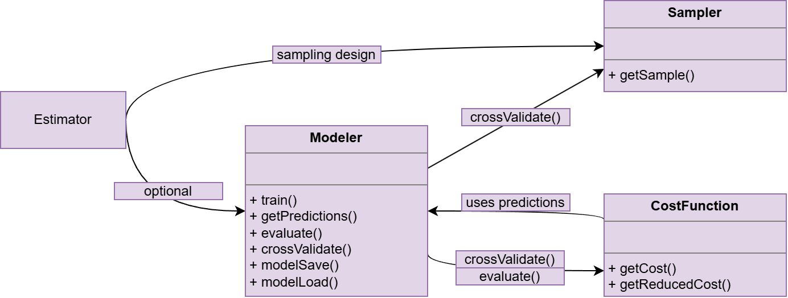

```{r setup, include=FALSE}
knitr::opts_chunk$set(echo = TRUE)
library(RMLutils)
library(data.table)
dir.create(file.path("./trained_modelers"), showWarnings = FALSE)
```
<!-- 
# -*- coding: utf-8 -*-
#------------------------------------------------------------------------------#
# Copyright (C) [2026] Instituto Nacional de Estadística
#
# Este archivo forma parte del proyecto MLutils.
#
# Licenciado bajo la Licencia Pública de la Unión Europea (EUPL) v.1.2.
# Puede obtener una copia de la licencia en la raiz de este proyecto o en:
# https://eupl.eu/1.2/es/
#
# A menos que se indique lo contrario, este software se distribuye
# "TAL CUAL", SIN GARANTÍAS NI CONDICIONES DE NINGÚN TIPO.
# Consulte la licencia para conocer los términos específicos.
#------------------------------------------------------------------------------#
# Copyright (C) [2026] National Institute of Statistics
#
# This file is part of the MLutils project.
#
# Licensed under the European Union Public License (EUPL) v.1.2.
# You can obtain a copy of the license at the root of this project or at:
# https://eupl.eu/1.2/es/
#
# Unless otherwise indicated, this software is distributed
# "AS IS", WITHOUT WARRANTIES OR CONDITIONS OF ANY KIND.
# See the license for specific terms.
#------------------------------------------------------------------------------#
-->

MLUtils proporciona una interfaz extensible por diseño para múltiples librerías de machine learning, facilitando la estandarización de tareas de ML en el proceso de la estadística oficial. Adicionalmente, tiene soporte integrado para diferentes diseños muestrales.

## Arquitectura de clases de RMLUtils

<!--{#id .class width=30 height=20px}-->

Las clases principales en MLUtils son los `modeler`, los `estimator` (que en RMLUtils son funciones a las que se llama directamente), los `sampler` y las `costFunction`.

* `Modeler`: Actúa como una abstracción de alto nivel que puede incluir tareas como el preprocesado.

* `Estimator`: Colección de funciones que gestionan la inferencia a nivel de la población.

* `Sampler`: Objeto que gestiona la extracción de muestras de un conjunto de datos o población. También proporciona metadatos necesarios para inferencia.

* `CostFunction`: Clase que define métricas de evaluación, tanto para medidas de rendimiento estándar como para criterios basados en diseño.

## Estructura de los tutoriales

Todos los objetos de RMLUtils están documentados en los tutoriales, con ejemplos de uso.

Se recomienda al usuario seguir el orden propuesto de los tutoriales:

1) `sampler_tutorial`

2) `modeler_tutorial`

3) `cost_function_tutorial`

4) `estimator_tutorial`

El resto de tutoriales pueden revisarse en orden arbitrario, dependiendo de las necesidades del usuario. A continuación se explica brevemente lo que desarrolla cada uno:

* `bench_modeler_tutorial`: Define el objeto benchModeler y cómo utilizarlo. Es un modeler multivariante en el cual las variables objetivo deben cumplir alguna o múltiples restricciones lineales entre ellas.

* `classifreg_modeler_tutorial`: Describe cómo utilizar los modelos classifReg, que son modelers en dos pasos (una clasificación seguida de una regresión). Son particularmente útiles para datos semicontínuos, es decir, aquellos que tienen uno o varios valores distintos repetidos muy habitualmente y luego una proporción menor de datos que se comporta de forma continua.

* `h2o_modeler_tutorial`: Explica cómo utilizar los modelers de h2o, ya que es necesario iniciar una nube localmente o en el servidor donde se esté trabajando para que funcionen.

* `memory_modeler_tutorial`: Define el memoryModeler, que es un tipo de modeler capaz de guardar conjuntos de datos internos para añadirlos a la hora de entrenar el modelo.

* `prepred_modeler_tutorial`: Describe el prePredModeler, también conocido como modelo en cadena. Emplea una combinación de dos modelers, donde el primero genera un regresor adicional para el segundo.

* `prepro_modeler_tutorial`: Desarrolla el uso de los preproModelers. Son un tipo de modelers que ejecutan un paso de preprocesado antes de entrenarse. Este paso lo realiza una función que puede ser definida por el usuario, pero que debe cumplir ciertas condiciones para funcionar con el resto de la librería.


